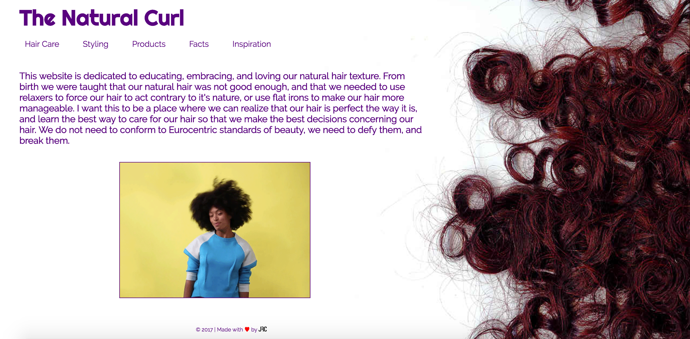

# README

I used HTML/CSS, Ruby on Rails, JavaScript, jQuery, Postgresql, and the YouTube Api.

As a user I want to learn more about how to take care of my natural hair.
In order to best take care of hair, as a user, I want to learn the best products to use for my hair.
As a new member of the natural hair community I want to know how to maximize my hair growth.
Since most people around me don't have the same hair type as mine, I want to know what to do with my hair.
As a person who uses relaxers, I want to know what the natural hair community is like, and if it's something I would be interested in doing.

Hurtles: YouTube API

I plan on using user authentication in the future so that nobody can edit the post, but me.
I also want to make a chat room to make the site interactive for users.
I'm still debating whether or not I want users to comment since I'm going to make a chat room.
